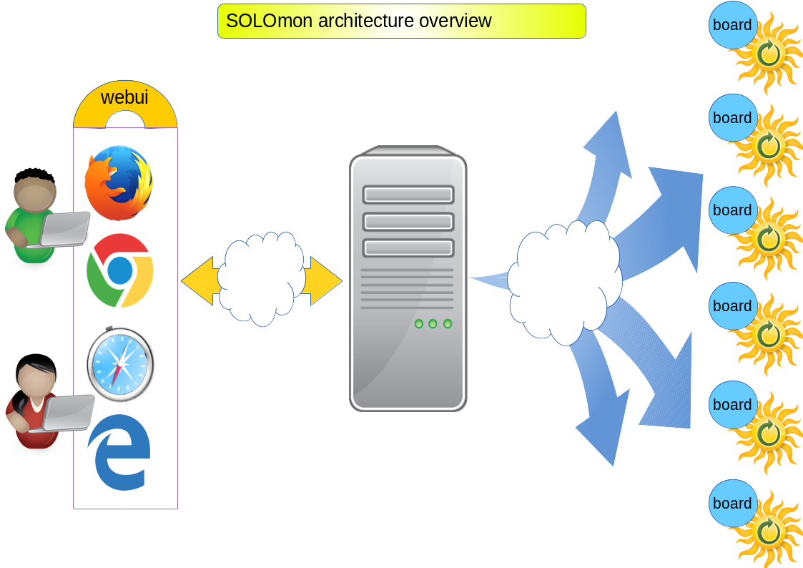

What is SOLOmon
===============

SOLOmon is the Solar Monitoring platform developed by beFair with the power of the Open Source inside (and outside!)

It aims to provide:

* modules to support many kinds of inverters
* amazing web dashboards for single or grouped plants 
* versatile alerting notifications
* authorization levels for user, reseller, producer, administrator

The big picture is composed of a cloud service for storage, web interface and access,
as well as single boards connected to the inverter of the solar plants production system.

.. _arch-overview:

	SOLOmon project architecture overview

What is the SOLOmon board
-------------------------

